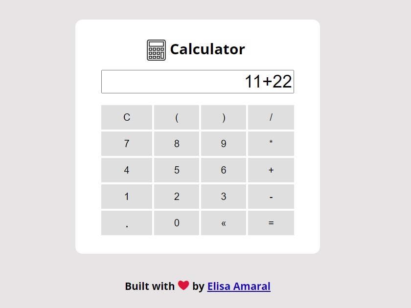

# Calculator built with JavaScript Factory Function

This project is a simple calculator that runs expressions of the four basic math operations.

## Project Website

**https://calculator-with-js-factory-function.netlify.app/**

## Screenshot

## Technology Stack

+ JavaScript
+ HTML
+ CSS
